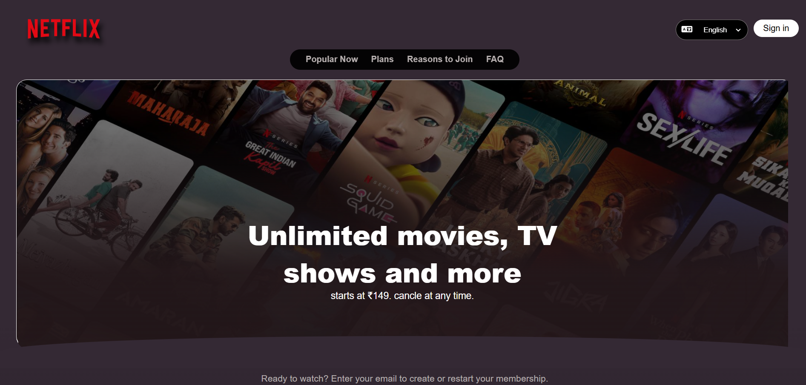

# 📺 Netflix UI Clone – HTML & CSS (Responsive)

This project is a front-end clone of the popular Netflix website, built using **HTML5** and **CSS3**. It mimics the layout and design of the Netflix homepage, complete with a responsive structure that adapts to different screen sizes.

## 🔗 Live Demo

👉 [Click here to view the live site](https://ui-by-nikitagupta.netlify.app/)  

## 📌 Features

- Modern Netflix-like homepage layout
- Responsive design for mobile, tablet, and desktop
- Hero section with background image and CTA buttons
- Card-based movie/show sections
- Footer with links 

## 💡 Purpose

The main goal of this project was to practice front-end development skills by recreating a well-known website using only HTML and CSS. It focuses on layout design, Flexbox, positioning, and responsiveness.

## 🛠️ Technologies Used

- HTML5  
- CSS3
-No frameworks or JavaScript – pure HTML & CSS

## 🖼️ Screenshot

## 📁 Folder Structure

- `index.html`: The main HTML file containing the structure of the page.
- `style.css`: The CSS file for styling the page.
- `README.md`: Documentation file explaining the project.
- `photos`: File containing images (like logos, screenshots, etc.)